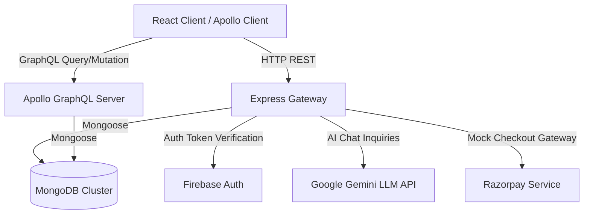

# 💳 ZenPay - Enterprise-Grade FinTech & QA Testing Platform

[](https://react.dev/)
[](https://graphql.org/)
[](https://nodejs.org/)
[](https://www.mongodb.com/)
[](https://www.jenkins.io/)

ZenPay is a robust, full-stack financial technology (FinTech) application paired with an enterprise-grade automated testing suite. It offers clean transactional services, AI-driven investment counseling, real-time dashboards, and a robust CI/CD validation architecture.

---

## 🏗️ System Architecture



### Key Components:
- **Frontend Core:** Single Page Application (SPA) driven by React, React Router, Tailwind CSS, and Apollo Client.
- **Backend Core:** High-performance Express API gateway supporting mixed GraphQL schemas & REST microservices.
- **AI Engine:** Google Gemini LLM API powering localized, profile-specific financial recommendations.
- **Data Persistence:** MongoDB for transaction ledger/profile storage, and Firebase for secure authentication.

---

## 🛠️ Technology Stack

| Layer | Technologies |
| :--- | :--- |
| **Frontend UI** | React 18, Tailwind CSS, Recharts (Data Visualization), Lucide React |
| **Client State** | Apollo Client (GraphQL Queries/Mutations), LocalStorage Session Caching |
| **Backend API** | Node.js, Express, Apollo Server Express 3, REST Routes |
| **Database** | MongoDB (Mongoose ODM), Firebase Authentication |
| **Integrations** | Google Gemini LLM API, Razorpay Checkout API |

---

## 🧪 Comprehensive QA Testing Suite

ZenPay features a multi-tiered automated testing hierarchy designed to validate system stability, E2E functional user flows, API durability, and high-concurrency throughput.

### 1. ☕ Selenium E2E Web Tests (Java + TestNG)
Designed for cross-browser visual flow verification. The suite tests 6 user journeys using automated Chrome environments.
- **Features:** Page Object Model elements, explicit Selenium wait states, and robust TestNG Assertions.
- **Target Suite:** `com.zenpay.selenium.AuthJourneyTest`
- **Execution:**
  ```bash
  cd selenium-tests
  mvn clean test
  ```
  *To run headlessly in CI/CD:*
  ```bash
  SELENIUM_HEADLESS=true mvn test
  ```

### 2. ⚡ Cypress E2E Tests (JavaScript)
Validates frontend UI state progression, client-side route guards, mock payment gateways, and CSS layout elements.
- **Features:** Dynamic network interception (`cy.intercept`), local storage state resets, and UI-element isolation testing.
- **Target Spec:** `cypress/e2e/auth.cy.js`
- **Execution:**
  ```bash
  cd frontend
  npx cypress run --browser chrome --headless
  ```

### 3. 📊 JMeter Performance Tests (load-testing)
Validates backend API throughput, routing speed, and database connection pools under synthetic concurrent client loads.
- **Features:** Parameterized thread groups, HTTP request assertions, and HTML performance reporting.
- **Execution:**
  ```bash
  cd jmeter-tests
  jmeter -n -t auth-login-signup.jmx -l results.jtl -Jprotocol=http -Jhost=localhost -Jport=8000
  ```
- **Report Generation:**
  ```bash
  jmeter -g results.jtl -o report/
  ```

---

## ⚙️ Jenkins CI/CD Integrations

ZenPay features out-of-the-box configurations for both Freestyle CI jobs and full Declarative Pipelines.

### Option A: Jenkins Freestyle Project Setup (Teacher's Method)
Configure a standard Freestyle build step executing shell commands against a running local app workspace.

1. **Start Server Locally:**
   ```bash
   cd Zenpay
   npm run start
   ```
2. **Execute Shell Script in Jenkins Configuration:**
   ```bash
   export PATH="/opt/homebrew/bin:/usr/local/bin:$PATH"
   export SELENIUM_HEADLESS=true

   # Run Selenium Tests
   cd selenium-tests
   mvn clean test

   # Run Cypress Tests
   cd ../frontend
   npx cypress run --browser chrome --headless
   ```
3. **Post-Build Action:**
   Add **Publish TestNG Results** and target `**/testng-results.xml`.

### Option B: Jenkins Declarative Pipeline (Self-Contained Automation)
Uses the root [Jenkinsfile](./Jenkinsfile) configuration. This automatically installs dependencies, cleans port conflicts, launches background servers, runs tests, and terminates subprocesses cleanly.

```groovy
pipeline {
    agent any
    environment {
        PATH = "/opt/homebrew/bin:/usr/local/bin:${env.PATH}"
        BASE_URL = 'http://127.0.0.1:5173'
        SELENIUM_HEADLESS = 'true'
    }
    stages {
        stage('Install Dependencies') { ... }
        stage('Start Zenpay App') { ... }
        stage('Selenium Tests') { ... }
        stage('Cypress Tests') { ... }
    }
    post {
        always {
            testng testResults: 'selenium-tests/target/surefire-reports/testng-results.xml'
            archiveArtifacts artifacts: 'backend.log, frontend.log', allowEmptyArchive: true
        }
    }
}
```

---

## 🚀 Getting Started

### Prerequisites
- Node.js (v18+)
- Java JDK 17+ (configured with Maven)
- MongoDB running locally on `localhost:27017`

### Installation
1. Clone this repository:
   ```bash
   git clone https://github.com/ChaitanyDalvi06/Zenpay_Testing.git
   ```
2. Install dependencies:
   ```bash
   cd Zenpay
   npm run install-all
   ```
3. Start the application servers:
   ```bash
   npm run start
   ```
4. Access the frontend locally at `http://localhost:5173`.
```
